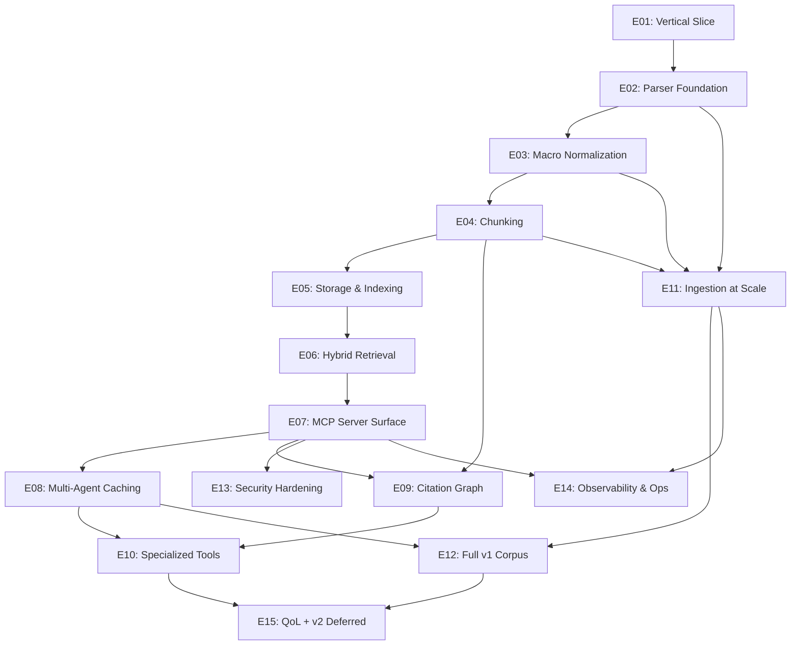

# arXMCP Roadmap

> **SUPERSEDED 2026-05-08.** The authoritative roadmap is now
> [`.claude/roadmap/README.md`](.claude/roadmap/README.md), which
> uses the current epic numbering (E05 = Eval Harness, E07 = Hybrid
> Retrieval, E08 = Agent Runtime + Caching). This file uses the
> older numbering (E05 = Storage & Indexing, E07 = MCP Server
> Surface, E08 = Multi-Agent Caching) and is preserved for
> historical reference only. New work follows the per-epic specs
> under `.claude/roadmap/`. Tier promotion conditions live in
> [`TIER-GATES.md`](TIER-GATES.md).

## Overview

arXMCP is a local-first, Docker-deployable Model Context Protocol (MCP) server that exposes a research-mathematics arXiv corpus (math.AG, math.NT, math-ph, hep-th) to multi-agent Claude pipelines (sketcher → autoformalizer → tactician → fixer). It is the substrate that plays the role NotebookLM plays in the Gemini ecosystem — but for Claude Code, with full multi-agent prompt-cache reuse, math-aware parsing (LaTeXML + macro expansion), and zero dependence on paid cloud services. The intended consumer is a single mathematician driving an agentic proof workflow on one workstation.

The design constitution lives in [`.claude/notes/`](.claude/notes/) (11 files, README + 01–10). Every roadmap item below traces back to a specific note.

## Hard constraints (recap from `.claude/notes/README.md`)

- **No AWS S3 / no requester-pays buckets.** Object storage in general is fine (Backblaze B2 for backups, etc.) but the arXiv ingestion path must not depend on `s3://arxiv/`.
- **No forking** of existing arXiv-MCP repos. Steal ideas; don't import code.
- **Must run locally in Docker.** Single-workstation deployment is the target. Multi-host scaling is an explicit non-goal for v1.
- **Multiple concurrent Claude sub-agents** must be able to use this server with shared caches across separate context windows.
- **Math fidelity over coverage.** 50K papers indexed correctly beats 500K with PyPDF mangling.

## Epic table

| # | Epic | Tier | Effort | Deps | Owner | Status |
|---|---|---|---|---|---|---|
| E01 | Vertical Slice (50-paper end-to-end loop) | 0 | 1–2 weeks | — | | not started |
| E02 | Parser Foundation (ar5iv → LaTeXML → Nougat fallback chain) | 1a | 1–2 weeks | E01 | | not started |
| E03 | Macro Normalization & Deterministic Canonical IR | 1b | 1 week | E02 | | not started |
| E04 | Math-Aware Chunking & Content-Addressable IDs | 1c | 1–2 weeks | E03 | | not started |
| E05 | Storage & Indexing (LanceDB schema + version pinning) | 1d | 1–2 weeks | E04 | | not started |
| E06 | Hybrid Retrieval & Reranking | 1e | 1 week | E05 | | not started |
| E07 | MCP Server Surface (Streamable HTTP, shim, full v1 tool surface) | 1f | 2 weeks | E06 | | not started |
| E08 | Multi-Agent Caching (3-tier retrieval + prompt-cache hygiene) | 2 | 1–2 weeks | E07 | | not started |
| E09 | Citation Graph (Kùzu + OpenAlex + INSPIRE) | 3 | 1–2 weeks | E04, E07 | | not started |
| E10 | Specialized Tools (definitions, theorem names, equation similarity, paper_diff, expand_macro) | 4 | 2 weeks | E08, E09 | | not started |
| E11 | Ingestion Pipeline at Scale (torrents seed + OAI-PMH + /e-print/) | 5a | 2 weeks | E02, E03, E04 | | not started |
| E12 | Full v1 Corpus (200K papers, daily delta, atomic version swap in production) | 5b | 1–2 weeks | E11, E08 | | not started |
| E13 | Security Hardening (seven threats from `08-security-observability-ops.md`) | cross-cutting | 1 week | E07 | | not started |
| E14 | Observability & Operations (Prometheus, OTel, Phoenix, backup/restore, runbooks) | cross-cutting | 1–2 weeks | E07, E11 | | not started |
| E15 | Quality of Life and v2 Deferred Work (Tier 6 + Tier 7) | 6 / 7 (deferred) | n/a | E10, E12 | | deferred |

Total: 15 epics.

## Epic dependency DAG



## Epic detail files

- [E01 — Vertical Slice](.claude/roadmap/epic-01-vertical-slice.md)
- [E02 — Parser Foundation](.claude/roadmap/epic-02-parser-foundation.md)
- [E03 — Macro Normalization](.claude/roadmap/epic-03-macro-normalization.md)
- [E04 — Math-Aware Chunking](.claude/roadmap/epic-04-chunking.md)
- [E05 — Storage and Indexing](.claude/roadmap/epic-05-storage-indexing.md)
- [E06 — Hybrid Retrieval and Reranking](.claude/roadmap/epic-06-hybrid-retrieval.md)
- [E07 — MCP Server Surface](.claude/roadmap/epic-07-mcp-server-surface.md)
- [E08 — Multi-Agent Caching](.claude/roadmap/epic-08-multi-agent-caching.md)
- [E09 — Citation Graph](.claude/roadmap/epic-09-citation-graph.md)
- [E10 — Specialized Tools](.claude/roadmap/epic-10-specialized-tools.md)
- [E11 — Ingestion at Scale](.claude/roadmap/epic-11-ingestion-at-scale.md)
- [E12 — Full v1 Corpus](.claude/roadmap/epic-12-full-corpus.md)
- [E13 — Security Hardening](.claude/roadmap/epic-13-security.md)
- [E14 — Observability and Operations](.claude/roadmap/epic-14-observability-ops.md)
- [E15 — QoL and v2 Deferred Work](.claude/roadmap/epic-15-qol-and-v2.md)

## How to use this roadmap

Each epic file under `.claude/roadmap/` contains GitHub-issue-shaped sub-issues. To create issues from these files, the maintainer runs (per sub-issue):

```sh
gh issue create \
  --title "<sub-issue title>" \
  --body-file <(awk '/^### E0._S0./,/^---$/' .claude/roadmap/epic-01-vertical-slice.md) \
  --label area:server,kind:feature
```

Or, for a bulk run, use a small shell script that splits each epic file at `### EXX_SYY` headings and pipes each block to `gh issue create`. Cross-references between sub-issues use the `EXX_SYY` notation; once issues are created, replace those with the GitHub issue number in subsequent edits.

Sub-issue ordering inside an epic respects dependency order — start at `S01` and move forward.

## Tier mapping summary

- **Tier 0 (vertical slice):** E01.
- **Tier 1 (math fidelity):** E02 → E07. This is where retrieval quality is made.
- **Tier 2 (multi-agent caching):** E08.
- **Tier 3 (citation graph):** E09.
- **Tier 4 (specialized indices):** E10.
- **Tier 5 (full-corpus scale):** E11 + E12.
- **Cross-cutting:** E13 (security), E14 (observability/ops). These thread through E01–E12 but are pulled into dedicated epics so the work is tracked.
- **Tier 6 + Tier 7 (deferred / v2):** E15 only — explicitly marked as not-in-v1.

## Non-goals (will not appear as work in this roadmap)

Per `09-feature-priorities.md` ("Things to explicitly NOT build in v1"), the following are absent by design:

- Multi-host scaling, replication, leader election.
- Authentication, multi-tenancy, audit logs.
- A web UI.
- PDF figure extraction (Tier 6 if at all — surfaced in E15 deferred only).
- OCR of pre-2007 scanned papers.
- Translation of non-English papers.
- Comments / discussion / blog tracking.
- An LLM "critic" tool.
- Live arXiv listings scraping.

If a future need surfaces one of these, it goes through the rubric in `09-feature-priorities.md` (six questions; ≥3 "no" answers → reject or defer).
